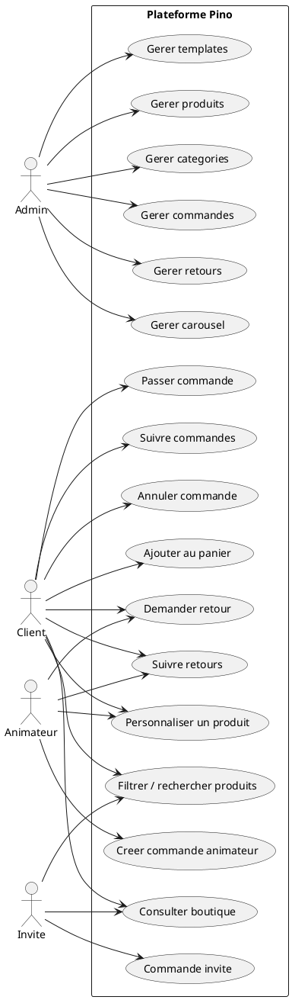
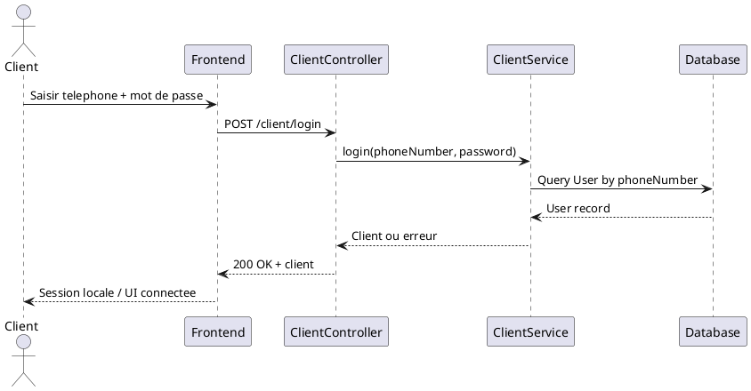
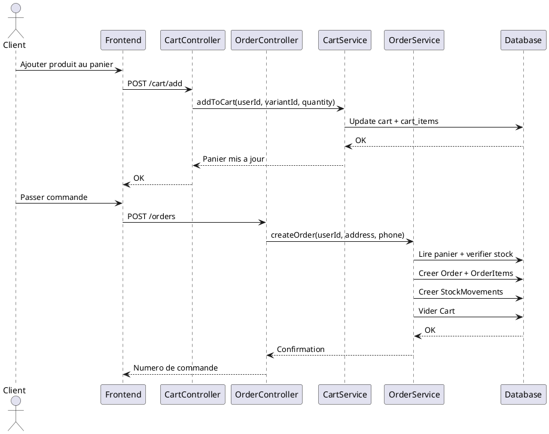
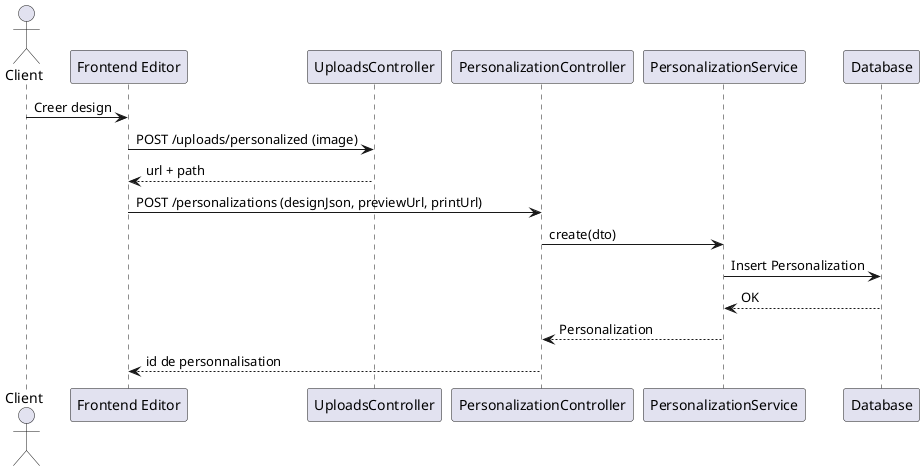
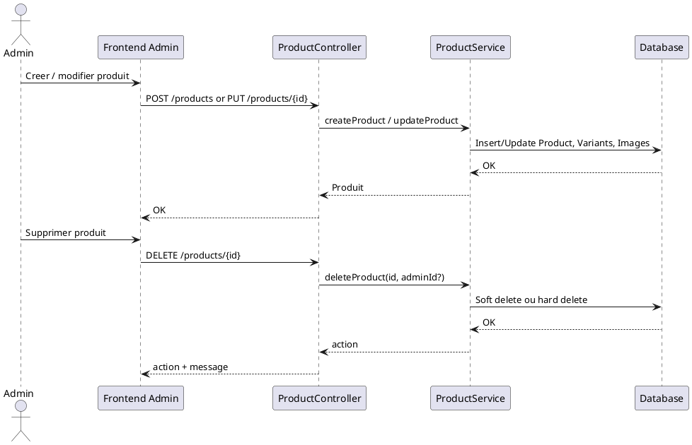

# Introduction Generale
- Contexte du projet
Le projet Pino est une plateforme de vente et de personnalisation de produits textiles, avec un site vitrine, une boutique en ligne, un editeur de personnalisation, et un back office d administration. L objectif principal est d offrir un parcours complet pour les clients et les animateurs, tout en permettant a l equipe administrative de gerer les catalogues, les commandes, les retours et les contenus visuels.

- Problematique
Centraliser dans une seule application la presentation de l offre, la personnalisation des produits, la gestion des stocks et des commandes, ainsi que les workflows de retour, tout en restant scalable et maintenable.

- Objectifs du projet
1. Proposer une boutique moderne et responsive.
2. Permettre la personnalisation graphique des produits.
3. Gerer le panier, les commandes et les retours.
4. Offrir un back office pour les operations admin.
5. Structurer les donnees via un schema relationnel robuste.

# Presentation Globale du Projet
## Vision generale
La plateforme vise a couvrir l ensemble du cycle de vie d un produit personnalise, depuis la consultation du catalogue jusqu a la livraison et la gestion des retours, avec une separation claire entre l interface publique, l espace client et les fonctions administratives.

## Perimetre fonctionnel
- Consultation du catalogue et filtrage des produits.
- Personnalisation via un editeur graphique.
- Gestion du panier et passage de commande.
- Commandes standard et commandes specifiques pour animateurs.
- Gestion des retours avec statuts et actions de traitement.
- Administration des produits, categories, images, carousel, templates.
- Gestion des utilisateurs (clients et animateurs).

## Acteurs du systeme
- Admin : pilote le catalogue, les contenus visuels, les commandes et les retours.
- Client : consulte, personnalise, commande et suit ses achats.
- Animateur : passe des commandes specifiques et peut initier des retours.
- Invite : passe une commande sans compte via un flux dedie.

# Architecture Generale
## Architecture globale (frontend / backend / base de donnees)
- Frontend : application Next.js (App Router) avec pages publiques, espace client, editeur et back office. Voir [Frontend/README.md](Frontend/README.md).
- Backend : API REST NestJS avec modules fonctionnels (produits, panier, commandes, retours, personnalisation, carousel, templates). Voir [Backend/src/app.module.ts](Backend/src/app.module.ts#L1-L28).
- Base de donnees : PostgreSQL accedee via Prisma, modele relationnel complet. Voir [Backend/prisma/schema.prisma](Backend/prisma/schema.prisma).
- Stockage fichiers : uploads pour images produits, carousel, templates et personalisations, servis en statique via /uploads. Voir [Backend/src/main.ts](Backend/src/main.ts#L16-L36).

## Choix technologiques
- Frontend : Next.js, React, TypeScript, Tailwind CSS, Fabric.js (editeur). Voir [Frontend/package.json](Frontend/package.json).
- Backend : NestJS, Prisma, PostgreSQL, class-validator, multer, passport, bcrypt, nodemailer, Twilio. Voir [Backend/package.json](Backend/package.json).

## Justification des choix
- Next.js et React pour un rendu rapide, une navigation fluide et un SEO correct.
- NestJS pour une architecture modulaire, testable et scalable.
- Prisma pour la coherence schema-code et la productivite sur PostgreSQL.
- Fabric.js pour un editeur de personnalisation riche et performant.

# Analyse Fonctionnelle
## Diagramme de cas d utilisation (Use Case)
- Description textuelle
Le systeme expose des fonctionnalites de consultation, personnalisation et commande pour les clients et animateurs. L administration gere le catalogue, les images, les commandes et les retours. Un flux de commande invite est prevu.

- Acteurs
Admin, Client, Animateur, Invite.

- Cas principaux
- Consulter la boutique et filtrer les produits.
- Personnaliser un produit et sauvegarder la personnalisation.
- Ajouter au panier et passer une commande.
- Consulter et annuler une commande.
- Creer une commande animateur.
- Demander et suivre un retour.
- Administrer produits, categories, commandes, retours, carousel et templates.



# Analyse Structurelle
## Diagramme de classes
- Description des entites
Le schema Prisma contient les entites principales suivantes : utilisateurs, catalogue produits et variantes, panier, commandes, retours, personnalisation, contenus visuels et historiques de suppression. Voir [Backend/prisma/schema.prisma](Backend/prisma/schema.prisma).

- Relations
Les relations principales structurent le catalogue (Category, Product, ProductVariant, Size), les transactions (Cart, Order, CustomOrder), la personnalisation (Personalization) et les workflows de retour (Return, ReturnItem).

- Contraintes
- Unicite sur les champs de reference (sku, orderNumber, returnNumber).
- Contraintes de suppression par cascade ou restriction selon l impact metier.
- Utilisation d enums pour les statuts et types.

```plantuml
@startuml
hide methods
skinparam classAttributeIconSize 0

class User {
  id: UUID
  firstName: String?
  lastName: String?
  email: String?
  password: String?
  phoneNumber: String
  address: String?
  role: Role
}

class Category {
  id: Int
  code: String?
  name: String
  description: Text?
}

class Product {
  id: BigInt
  code: String
  name: String
  description: Text?
  color: String
  price: Decimal
  isActive: Boolean
  isDeleted: Boolean
}

class ProductVariant {
  id: BigInt
  sku: String
  stock: Int
}

class Size {
  id: Int
  name: SizeName
}

class ProductImage {
  id: Int
  imageUrl: String
  viewType: ImageViewType
  order: Int
}

class ProductDeletionRequest {
  id: UUID
  status: String
  reason: Text?
  createdBy: UUID?
}

class StockMovement {
  id: BigInt
  quantity: Int
  type: StockMovementType
  reason: String?
}

class Cart {
  id: UUID
}

class CartItem {
  id: BigInt
  quantity: Int
  personalizationId: UUID?
}

class Order {
  id: UUID
  orderNumber: String
  status: OrderStatus
  totalAmount: Decimal
  address: Text
  phoneNumber: String
}

class OrderItem {
  id: BigInt
  quantity: Int
  unitPrice: Decimal
  totalPrice: Decimal
  personalizationId: UUID?
}

class CustomOrder {
  id: UUID
  orderNumber: String
  status: OrderStatus
  totalAmount: Decimal
  hotelName: String?
}

class CustomOrderItem {
  id: BigInt
  printedName: String
  textLanguage: TextLanguage
  withDjerbaLogo: Boolean
  quantity: Int
}

class Personalization {
  id: UUID
  viewType: ImageViewType
  designJson: Json?
  previewUrl: String
  printUrl: String
}

class Return {
  id: UUID
  returnNumber: String
  reason: ReturnReason
  status: ReturnStatus
}

class ReturnItem {
  id: BigInt
  quantityReturned: Int
  action: ReturnAction?
  newVariantId: BigInt?
}

class CarouselSlide {
  id: Int
  title: String?
  imageUrl: String
  order: Int
}

class AlbumTemplate {
  id: Int
  name: String
  imageUrl: String
}

enum Role { ADMIN; CLIENT; ANIMATEUR }
enum OrderStatus { EN_ATTENTE; EN_COURS; LIVRE; ANNULE }
enum SizeName { XS; S; M; L; XL; XXL }
enum TextLanguage { FRENCH_ARABIC; ARABIC_ONLY; FRENCH_ONLY }
enum ImageViewType { AVANT; DOS; COTE }
enum StockMovementType { IN; OUT }
enum ReturnReason { ERREUR_IMPRESSION; MAUVAISE_TAILLE; MAUVAISE_LANGUE; PRODUIT_DEFECTUEUX; AUTRE }
enum ReturnStatus { EN_ATTENTE; APPROUVE; REFUSE; EN_TRAITEMENT; TRAITE }
enum ReturnAction { REIMPRESSION; CHANGEMENT_TAILLE; AVOIR; REMBOURSEMENT }

User "1" -- "0..1" Cart
User "1" -- "0..*" Order
User "1" -- "0..*" CustomOrder
User "1" -- "0..*" Return
User "1" -- "0..*" ProductDeletionRequest

Category "1" -- "0..*" Product
Product "1" -- "0..*" ProductVariant
Product "1" -- "0..*" ProductImage
Product "1" -- "0..1" ProductDeletionRequest

ProductVariant "*" -- "1" Size
ProductVariant "1" -- "0..*" StockMovement
ProductVariant "1" -- "0..*" CartItem
ProductVariant "1" -- "0..*" OrderItem
ProductVariant "1" -- "0..*" CustomOrderItem
ProductVariant "1" -- "0..*" ReturnItem

Cart "1" -- "0..*" CartItem
Order "1" -- "0..*" OrderItem
Order "1" -- "0..*" Return
CustomOrder "1" -- "0..*" CustomOrderItem
CustomOrder "1" -- "0..*" Return

OrderItem "1" -- "0..*" ReturnItem
CustomOrderItem "1" -- "0..*" ReturnItem
Personalization "1" -- "0..*" CartItem
Personalization "1" -- "0..*" OrderItem
Personalization "1" -- "0..*" CustomOrderItem

Return "1" -- "0..*" ReturnItem
@enduml
```

# Analyse Dynamique
## Diagrammes de sequence
- Authentification


- Gestion des commandes


- Personnalisation du produit


- Administration


# Decoupage du Projet par Module
## Frontend
- Role
Interface utilisateur principale (public, client, animateur, admin) et editeur de personnalisation.

- Fonctionnalites
- Boutique et catalogue.
- Editeur de personnalisation.
- Panier et commandes.
- Pages d authentification et gestion de profil.
- Portail admin.

- Pages principales
- Accueil : [Frontend/app/page.tsx](Frontend/app/page.tsx)
- Boutique : [Frontend/app/boutique](Frontend/app/boutique)
- Editeur : [Frontend/app/editor](Frontend/app/editor)
- Panier : [Frontend/app/cart](Frontend/app/cart)
- Commandes : [Frontend/app/orders](Frontend/app/orders)
- Admin : [Frontend/app/admin](Frontend/app/admin)
- Auth : [Frontend/app/login](Frontend/app/login), [Frontend/app/signup](Frontend/app/signup), [Frontend/app/forgot-password](Frontend/app/forgot-password)
- Espace animateur : [Frontend/app/mes-commandes](Frontend/app/mes-commandes), [Frontend/app/mes-retours](Frontend/app/mes-retours)

## Backend
- Services et controllers
Modules exposes via REST : produits, categories, panier, commandes, commandes animateurs, retours, personnalisation, carousel, templates, uploads. Voir [Backend/src/app.module.ts](Backend/src/app.module.ts#L1-L28).

- Securite
Presence d un guard JWT mais actuellement permissif. Voir [Backend/src/auth/jwt-auth.guard.ts](Backend/src/auth/jwt-auth.guard.ts#L1-L10). Les roles sont definis dans le schema et un RolesGuard est disponible. Voir [Backend/src/auth/roles.guard.ts](Backend/src/auth/roles.guard.ts#L1-L24).

- APIs
Exemples d endpoints :
- Produits : GET/POST/PUT/DELETE /products, gestion images et variants. Voir [Backend/src/product/product.controller.ts](Backend/src/product/product.controller.ts#L1-L167).
- Panier : /cart (get, add, update, delete, clear). Voir [Backend/src/cart/cart.controller.ts](Backend/src/cart/cart.controller.ts#L1-L92).
- Commandes : /orders (create, list, status, cancel, guest). Voir [Backend/src/order/order.controller.ts](Backend/src/order/order.controller.ts#L1-L90).
- Retours : /returns (admin, animateur/client). Voir [Backend/src/return/return.controller.ts](Backend/src/return/return.controller.ts#L1-L133).
- Commandes animateur : /custom-orders. Voir [Backend/src/custom-order/custom-order.controller.ts](Backend/src/custom-order/custom-order.controller.ts#L1-L96).
- Personalisation : /personalizations. Voir [Backend/src/personalization/personalization.controller.ts](Backend/src/personalization/personalization.controller.ts#L1-L18).
- Carousel : /carousel. Voir [Backend/src/carousel/carousel.controller.ts](Backend/src/carousel/carousel.controller.ts#L1-L134).
- Templates : /templates. Voir [Backend/src/templates/templates.controller.ts](Backend/src/templates/templates.controller.ts#L1-L106).
- Uploads : /uploads/personalized. Voir [Backend/src/uploads/uploads.controller.ts](Backend/src/uploads/uploads.controller.ts#L1-L55).

## Base de donnees
- Modele relationnel
Structure centree sur Product et ProductVariant, avec panier, commandes, retours et personnalisation. Voir [Backend/prisma/schema.prisma](Backend/prisma/schema.prisma).

- Enumerations
Role, OrderStatus, SizeName, TextLanguage, ImageViewType, StockMovementType, ReturnReason, ReturnStatus, ReturnAction.

- Relations
Relations 1-N entre utilisateurs et commandes, produits et variantes, commandes et items, retours et items, etc.

# Securite et Gestion des Acces
- Authentification
Un endpoint de login client est disponible, mais les guards JWT sont desactives ou permissifs. L utilisateur est souvent derive de l en-tete x-user-id ou d un fallback. Voir [Backend/src/cart/cart.controller.ts](Backend/src/cart/cart.controller.ts#L1-L92).

- Autorisation
Un RolesGuard existe mais depend de request.user, non renseigne tant que le JWT n est pas implemente. Voir [Backend/src/auth/roles.guard.ts](Backend/src/auth/roles.guard.ts#L1-L24).

- Roles
Les roles ADMIN, CLIENT, ANIMATEUR sont definis au niveau du schema. Voir [Backend/prisma/schema.prisma](Backend/prisma/schema.prisma#L11-L20).

# Conclusion Generale
- Resultats obtenus
Le projet fournit une plateforme complete avec catalogue, personnalisation, commandes, retours et outils d administration. L architecture est modulaire et basee sur des technologies modernes.

- Limites
- Les guards JWT sont provisoires et n appliquent pas la securite par roles.
- Plusieurs documents indiquent une simplification vers un modele TShirt unique, tandis que le schema actuel reste base sur Product et ProductVariant, ce qui merite une harmonisation documentaire. Voir [Backend/prisma/schema.prisma](Backend/prisma/schema.prisma).
- Certains guides sont vides ou incomplets, ce qui limite la vision globale.

- Perspectives d evolution
1. Finaliser l authentification JWT et l attribution des roles.
2. Aligner la documentation et le schema final retenu.
3. Ajouter des tests automatises end to end pour les flux principaux.
4. Industrialiser la gestion des fichiers (stockage externe).
